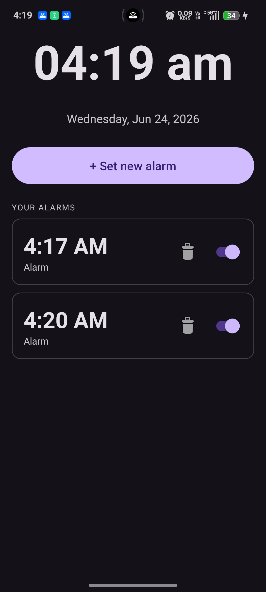
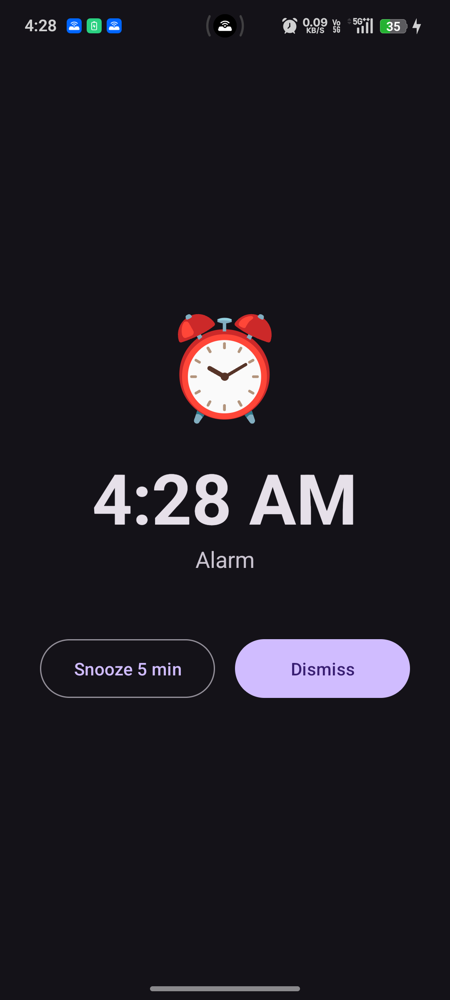

# ⏰ AlarmClock — Android Alarm App

A clean, fully functional alarm clock app for Android built with Kotlin. Set and manage multiple alarms, choose from four alarm tones, snooze or dismiss when the alarm fires, and have alarms persist across reboots.

---

## Screenshots

<p align="center">
  
  &nbsp;&nbsp;&nbsp;&nbsp;
  
</p>
<p align="center">
  <em>Home Screen &nbsp;&nbsp;&nbsp;&nbsp;&nbsp;&nbsp;&nbsp;&nbsp;&nbsp;&nbsp;&nbsp;&nbsp;&nbsp;&nbsp;&nbsp;&nbsp;&nbsp;&nbsp; Ringing Screen</em>
</p>

## Features

- 🕐 **Live clock** — current time and date on the home screen, updated every second
- ➕ **Set alarms** — time picker with AM/PM, custom label, and tone selection
- 🎵 **Four alarm tones** — Gentle chime, Classic beep, Digital pulse, Morning bell
- 📋 **Alarm list** — all alarms listed with an on/off toggle and delete button
- 😴 **Snooze** — delays the alarm by 5 minutes
- ✖️ **Dismiss** — stops the alarm immediately
- 💾 **Persistent storage** — alarms are saved to SharedPreferences and survive app restarts
- 🔁 **Boot receiver** — alarms are automatically rescheduled after the device reboots
- 🔔 **Foreground service** — alarm fires reliably even when the app is in the background

---

## Tech stack

| Layer | Technology                                 |
|---|--------------------------------------------|
| Language | Kotlin                                     |
| Min SDK | API 26 (Android 8.0)                       |
| Compile SDK | API 36                                     |
| UI | XML layouts + Material 3 components        |
| Scheduling | `AlarmManager.setExactAndAllowWhileIdle`   |
| Audio | Manually installing audios                 |
| Storage | `SharedPreferences` + Gson                 |
| Background | Foreground `Service` + `BroadcastReceiver` |

---

## Project structure

```
app/src/main/
├── java/com/example/alarmclock/
│   ├── Alarm.kt               # Data model
│   ├── AlarmAdapter.kt        # RecyclerView adapter for alarm list
│   ├── AlarmReceiver.kt       # BroadcastReceiver — fires alarm & handles boot
│   ├── AlarmScheduler.kt      # Schedules / cancels alarms via AlarmManager
│   ├── AlarmService.kt        # Foreground service — plays tone, launches ringing screen
│   ├── AlarmStorage.kt        # SharedPreferences read/write helper
│   ├── MainActivity.kt        # Home screen with live clock and alarm list
│   └── RingingActivity.kt     # Full-screen alarm ringing UI
├── res/
│   ├── layout/
│   │   ├── activity_main.xml
│   │   ├── activity_ringing.xml
│   │   ├── dialog_add_alarm.xml
│   │   └── item_alarm.xml
│   └── raw/
│       ├── beep.mp3
│       ├── chime.mp3
│       ├── pulse.mp3
│       └── bell.mp3
└── AndroidManifest.xml
```

---

## Getting started

### Prerequisites

- Android Studio Hedgehog or newer
- Android SDK 36 installed
- A physical device or emulator running Android 8.0 (API 26) or higher

### Installation

1. Clone the repository:
   ```bash
   git clone https://github.com/your-username/AlarmClock.git
   ```

2. Open the project in Android Studio:
   ```
   File → Open → select the AlarmClock folder
   ```

3. Add alarm sound files to `res/raw/`:
    - `beep.mp3`
    - `chime.mp3`
    - `pulse.mp3`
    - `bell.mp3`

   Free sounds are available at [freesound.org](https://freesound.org) and [mixkit.co](https://mixkit.co/free-sound-effects/).

4. Sync Gradle, build, and run on your device or emulator.

---

## Permissions used

| Permission | Reason |
|---|---|
| `SCHEDULE_EXACT_ALARM` | Fire alarms at the exact time set by the user |
| `USE_EXACT_ALARM` | Required on API 33+ for exact alarm scheduling |
| `RECEIVE_BOOT_COMPLETED` | Re-schedule alarms after device reboot |
| `VIBRATE` | Vibrate the device when an alarm fires |

---

## Known limitations

- Alarm tones must be manually added to `res/raw/` — no in-app download
- Repeat days (e.g. Mon–Fri) are not yet supported
- No system ringtone picker — tones are bundled with the app

---

## Future Improvements

- [ ] Repeat days selector (Mon, Tue, Wed…)
- [ ] System ringtone picker via `RingtoneManager`
- [ ] Room database to replace SharedPreferences
- [ ] Alarm volume control within the app
- [ ] Widget for the home screen
- [ ] Dark / light theme toggle

---

## License

This project is licensed under the MIT License. See the [LICENSE](LICENSE) file for details.

---